# Análise de Churn em Telecomunicações


Projeto de análise preditiva para identificação de clientes com risco de cancelamento em empresas de telecomunicações.

## Sobre o Projeto

Este trabalho foi desenvolvido para construir um modelo de machine learning capaz de identificar padrões nos dados dos clientes que indicam maior probabilidade de cancelamento dos serviços (churn). O projeto inclui análise exploratória, feature engineering, modelagem e um dashboard interativo.

## Problema de Negócio

Empresas de telecomunicações enfrentam desafios significativos com a rotatividade de clientes. Identificar quais clientes estão propensos a cancelar permite que a empresa tome medidas preventivas, como ofertas personalizadas ou melhorias no atendimento.

## Resultados Principais

O modelo Random Forest apresentou o melhor desempenho:
- **ROC AUC:** 0.744
- **Precision:** 56.5%
- **Recall:** 53.8%

As features mais importantes para predição de churn:
1. Número de reclamações nos últimos 30 dias
2. Tempo de relacionamento com a empresa (tenure)
3. Tipo de contrato

## Análise Exploratória

### Distribuição de Churn

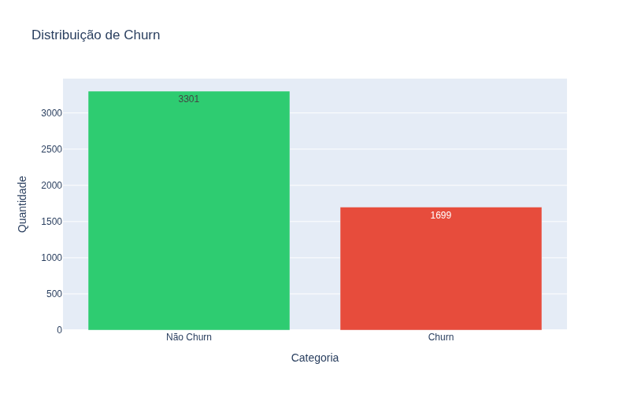
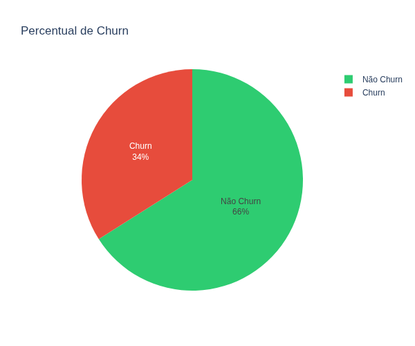

### Churn por Tipo de Contrato

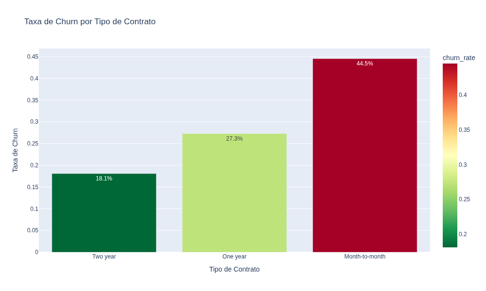

### Churn por Tenure

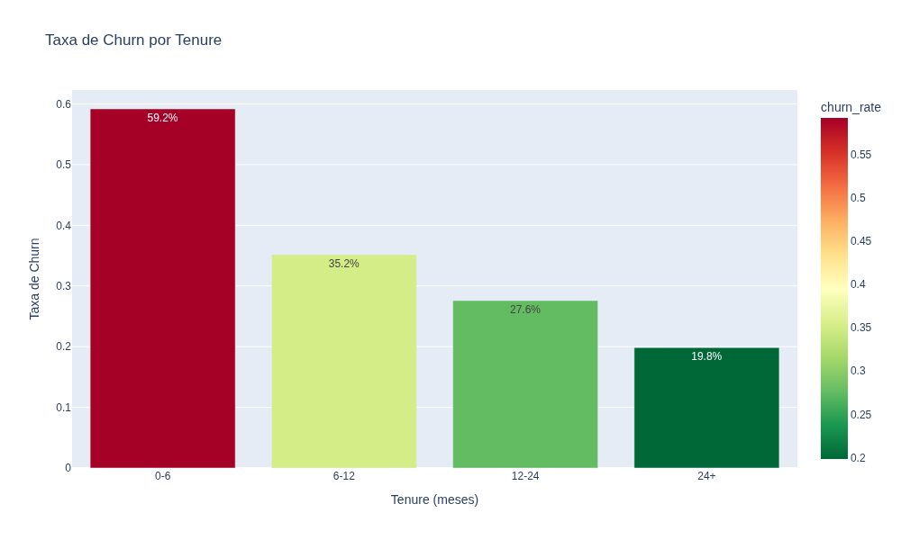

### Impacto de Reclamações

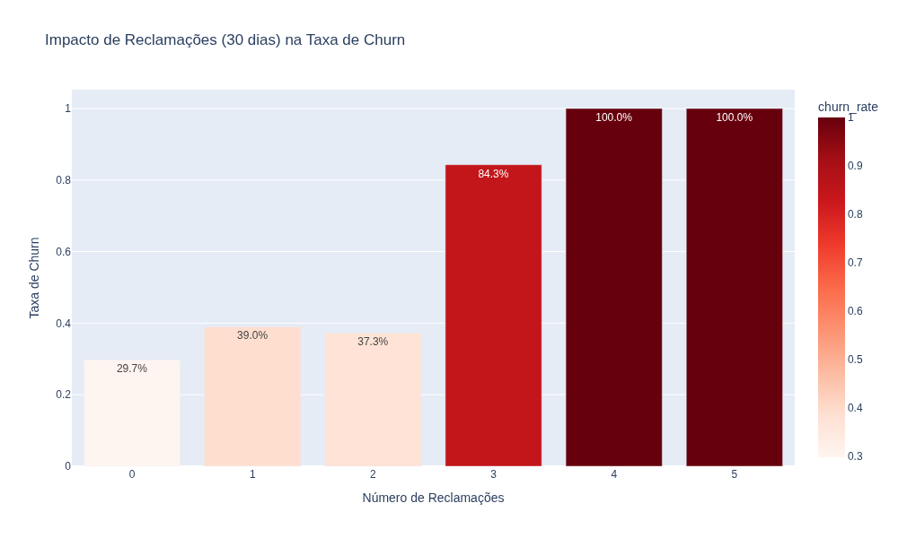

### Churn por Serviço de Internet

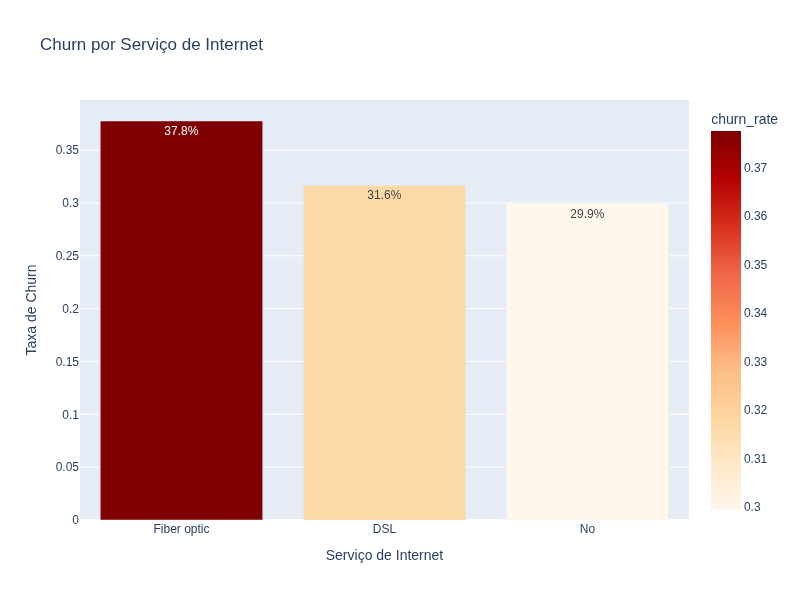

### Distribuição de Cobrança Mensal

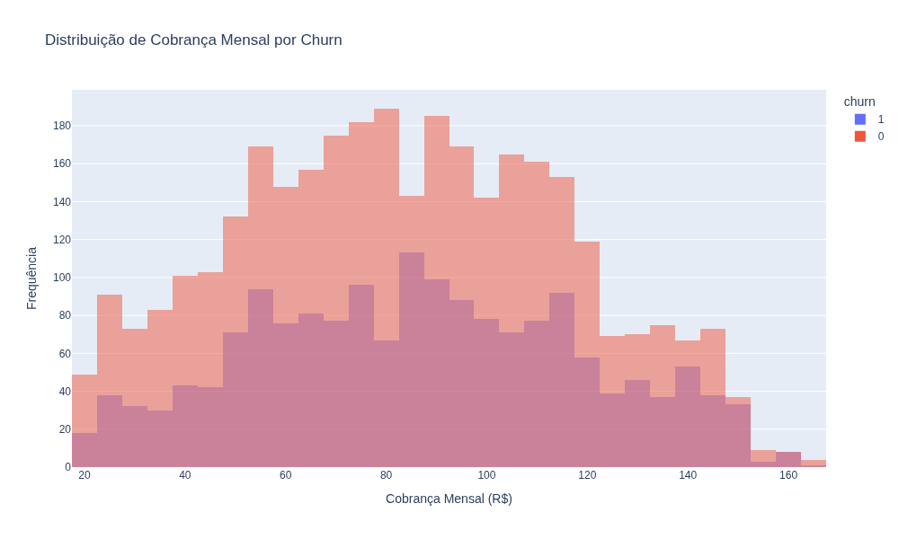

## Modelagem

### Comparação de Modelos

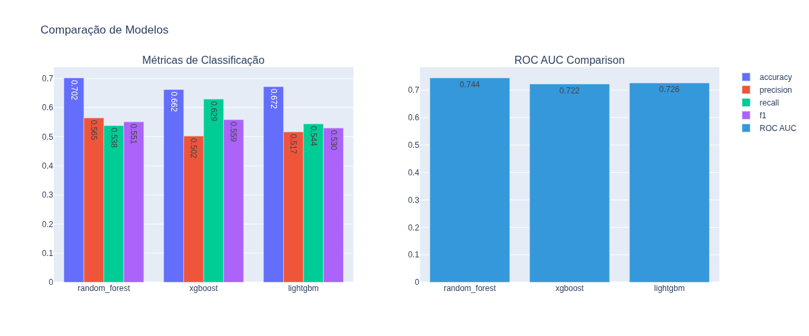

### Matriz de Confusão (Random Forest)

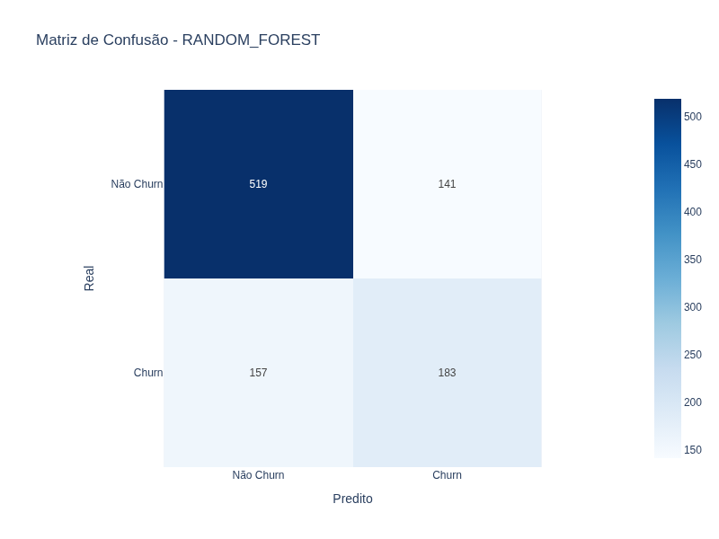

### Feature Importance

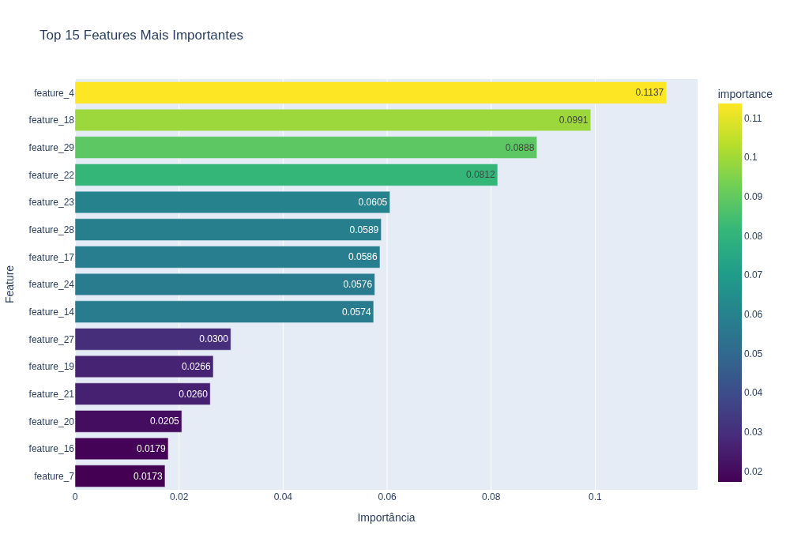

### Correlações entre Features

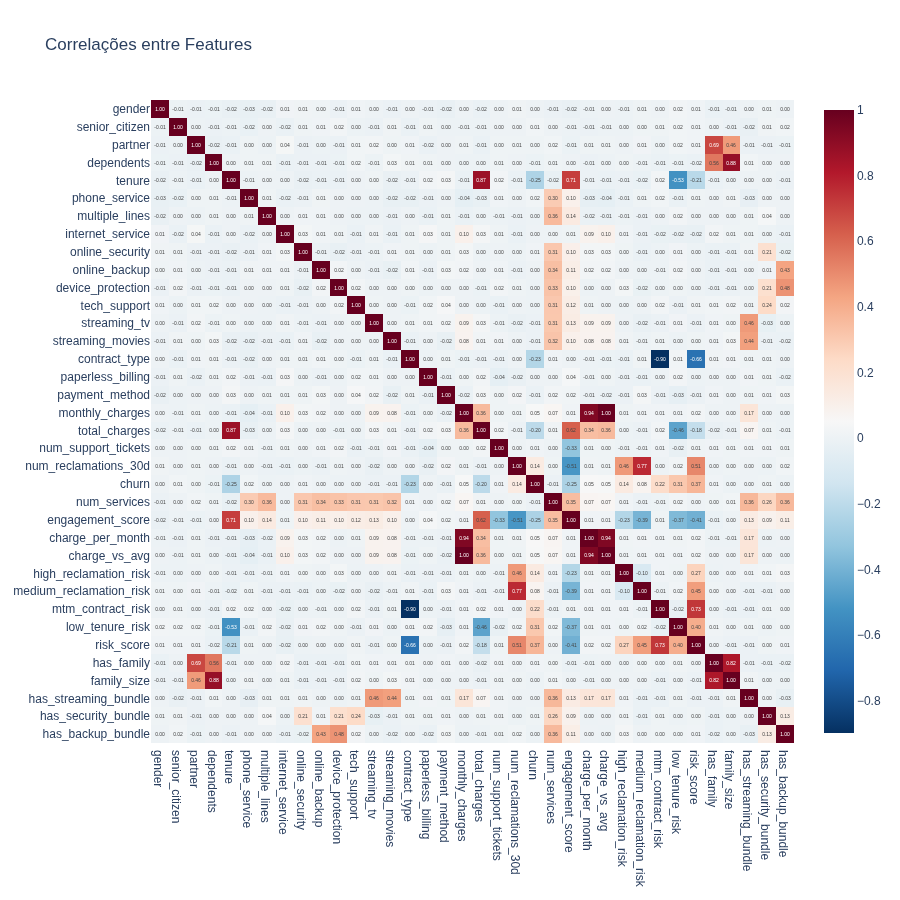

## Segmentação de Risco

### Distribuição do Score de Risco

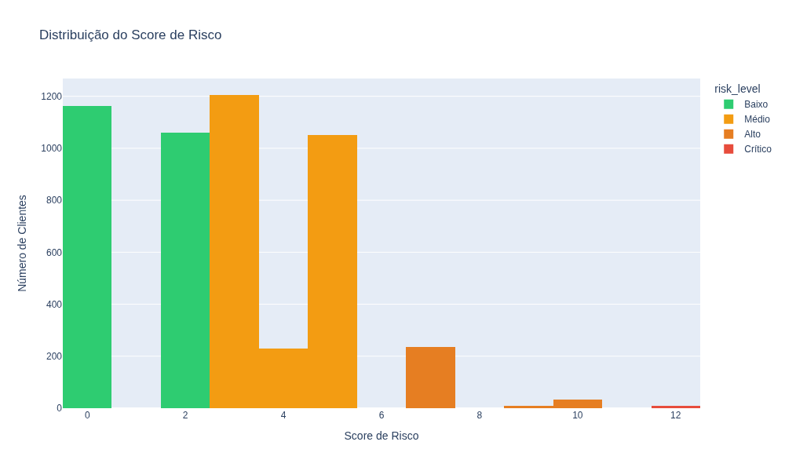

### Churn Rate por Nível de Risco

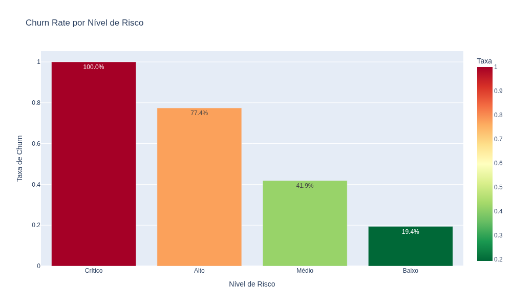

## Estrutura do Projeto

```
projeto_churn_telecom/
├── data/
│   ├── raw/          # Dados brutos
│   └── processed/    # Dados processados
├── notebooks/        # Jupyter notebooks
├── src/
│   ├── data/        # Carregamento de dados
│   ├── features/    # Feature engineering
│   ├── models/      # Modelos de ML
│   └── visualization/  # Gráficos
├── reports/
│   ├── figures/     # Figuras exportadas
│   └── tables/      # Tabelas exportadas
├── config/          # Configurações
└── dashboard/      # Dashboard Streamlit
```

## Como Executar

```bash
# Clonar repositório
git clone https://github.com/seu-usuario/projeto-churn-telecom.git
cd projeto-churn-telecom

# Criar ambiente virtual
python -m venv venv
source venv/bin/activate

# Instalar dependências
pip install -r requirements.txt

# Executar análise (notebooks)
jupyter lab notebooks/

# Executar dashboard
streamlit run dashboard/app.py
```

## Tecnologias

- **Python 3.10+**
- **Pandas, NumPy** - Manipulação de dados
- **Scikit-learn** - Machine learning
- **XGBoost, LightGBM** - Gradient Boosting
- **Matplotlib, Seaborn, Plotly** - Visualização
- **Streamlit** - Dashboard interativo

## Insights Principais

1. **Reclamações são o fator mais importante**: Clientes com 3+ reclamações em 30 dias têm chance significativamente maior de churn.

2. **Contratos MTM têm alto risco**: Contratos month-to-month apresentam taxa de churn muito superior a contratos anuais ou bienais.

3. **Tenure baixo = risco alto**: Clientes nos primeiros 6 meses são os mais propensos a cancelar.

4. **Serviços de internet fiber optic** apresentam o maior churn entre os tipos de conexão.


